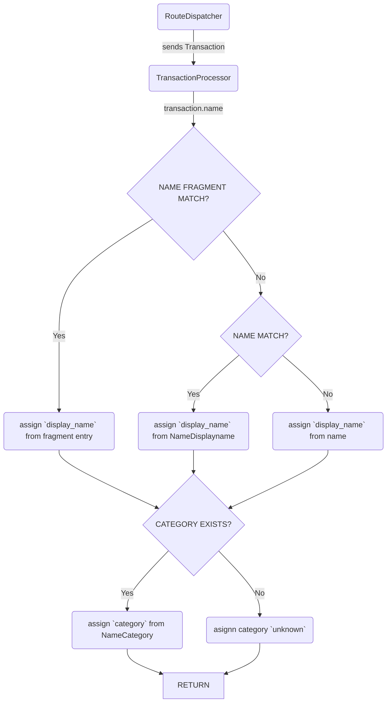

```mermaid
flowchart TD
    rd(RouteDispatcher)--> |sends Transaction| tp(TransactionProcessor)
    
    tp --> |transaction.name| NAME_FRAGMENT_MATCH?{NAME FRAGMENT MATCH?}
    NAME_FRAGMENT_MATCH? -->|Yes| ANFE(assign `display_name` from fragment entry)
    
    NAME_FRAGMENT_MATCH? -->|No| NAME_EXISTS?{NAME MATCH?}
    NAME_EXISTS? -->|Yes| ADNFDN(assign `display_name` from NameDisplayname)
    NAME_EXISTS? -->|No| ADNFN(assign `display_name` from name)
    
    ANFE --> CATEGORY_EXISTS?{CATEGORY EXISTS?}
    ADNFDN --> CATEGORY_EXISTS?
    ADNFN --> CATEGORY_EXISTS?
    
    CATEGORY_EXISTS? -->|Yes| D(assign `category` from NameCategory)
    CATEGORY_EXISTS? -->|No| E(asignn category `unknown`)
    
    D--> RETURN
    E --> RETURN
    
    
    
```